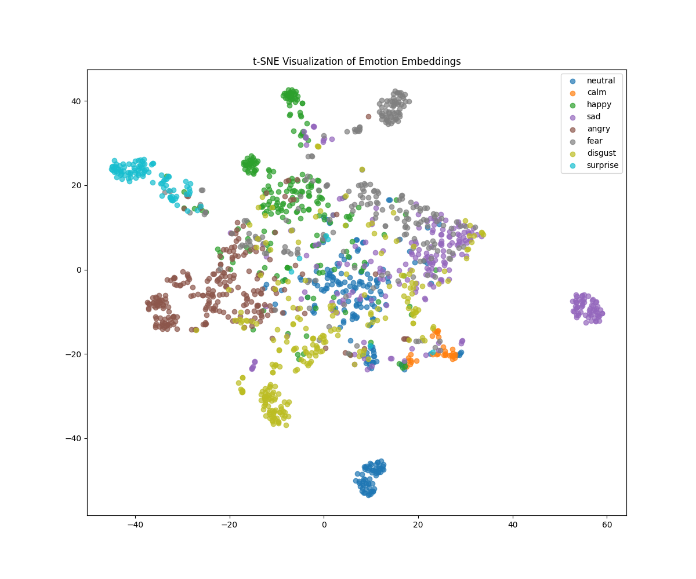
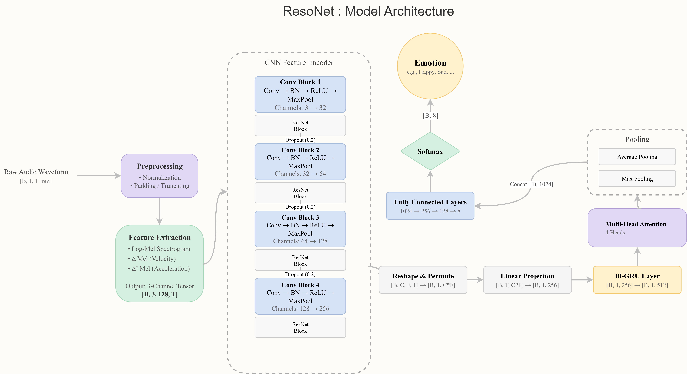

# ResoNet: A Synergistic Deep Learning Architecture for Robust Cross-Corpus Speech Emotion Recognition

[](LICENSE)
[](https://www.python.org/downloads/release/python-380/)

Official PyTorch implementation and pretrained models for:
**ResoNet: A Synergistic Deep Learning Architecture for Robust Cross-Corpus Speech Emotion Recognition**

This repository provides a complete framework for building, training, evaluating, and benchmarking the ResoNet architecture for Speech Emotion Recognition (SER) tasks.

---


*A key result: ResoNet transforms the chaotic feature space of traditional audio features (left) into a highly structured and separable embedding space (right).*

## Abstract

The human voice is rich in emotional content, yet machine learning models struggle to generalize emotion recognition across diverse recording conditions and speaker identities. This challenge, known as the "cross-corpus chasm," limits real-world applicability.

ResoNet addresses this by introducing a holistic, multi-domain training paradigm and a synergistic deep learning architecture that includes:

* A ResNet-style CNN backbone
* Bidirectional GRUs
* A Multi-Head Attention mechanism

Trained across RAVDESS, CREMA-D, TESS, and SAVEE with strict speaker-independence, ResoNet reaches a Macro F1-score of **83.3%**, on par with a fine-tuned Wav2Vec2 model, but with a significantly lighter footprint.

---

## Features

* **Robust Cross-Corpus Generalization** with multi-dataset training.
* **End-to-End Deep Architecture**: CNN + BiGRU + Attention.
* **Speaker-Independent Protocol** and 8-class classification.
* **Modular and Extensible** codebase for research and experimentation.
* **Includes Baselines**: Wav2Vec2, SVM (eGeMAPS), CNNLSTM, and ablation models.

---

## Architecture


*Figure: ResoNet architecture showcasing the flow through ResNet blocks, BiGRU, and multi-head attention.*


## Installation

```bash
git clone https://github.com/nikhil-yn-aix/ResoNet.git
cd ResoNet
pip install -r requirements.txt
```

---

## Dataset Setup

Place your datasets inside a `datasets/` directory:

```
datasets/
├── crema_dataset/
├── ravdess_dataset/
├── savee_dataset/
└── tess_dataset/
```

Then run:

```bash
python data_split.py
```

This generates `train.csv`, `val.csv`, and `test.csv` using speaker-independent splits.

---

## Training

To train ResoNet:

```bash
python resonet.py
```

* Logs and checkpoints are saved in `results/`
* Best model: `results/best_model.pth`

To train baselines and ablations:

```bash
python baseline_ablation_train.py  # For CNNLSTM, SVM, etc.
python wav2vec2_train.py            # For Wav2Vec2 baseline
```

---

## Inference with Pretrained Model

1. Download `best_resonet.pth` and place it in the project root.
2. Run:

```python
from resonet import predict_emotion

model_path = 'best_resonet.pth'
audio_file = 'path/to/audio.wav'

prediction, confidence, top3 = predict_emotion(model_path, audio_file)
print("Emotion:", prediction)
print("Confidence:", confidence)
print("Top 3:", top3)
```

---

## Results (Speaker-Independent)

| Model              | Accuracy (95% CI)   | F1-Macro (95% CI)       |
| ------------------ | ------------------- | ----------------------- |
| **ResoNet (Ours)** | 82.1% \[.803, .840] | **83.3% \[.814, .854]** |
| Wav2Vec2           | 82.0% \[.801, .838] | 81.8% \[.797, .838]     |
| NoAttentionResoNet | 64.2% \[.618, .665] | 65.6% \[.626, .680]     |
| SVM (eGeMAPS)      | 56.1%               | 56.3%                   |
| CNNLSTM            | 40.9% \[.385, .435] | 40.3% \[.380, .426]     |

> ResoNet matches Wav2Vec2 in performance while being significantly smaller and training from scratch.

---

## Evaluation and Visualization

To reproduce performance comparisons:

```bash
python model_compare.py
```

Generates accuracy/F1 comparisons and confidence intervals.

---

## 📄 License

This project is licensed under the MIT License. A copy of the license is included [here](LICENSE).

---

## Citation

> 📌 *Note: The paper is currently under submission.*
> You may refer to this repository as:
>
> **"ResoNet: A Synergistic Deep Learning Architecture for Robust Cross-Corpus Speech Emotion Recognition" by Y. N. Nikhil et al., 2025 (preprint)**

BibTeX (for reference only):

```bibtex
@article{Nikhil2025ResoNet,
  title={{ResoNet: A Synergistic Deep Learning Architecture for Robust Cross-Corpus Speech Emotion Recognition}},
  author={Nikhil, Y N and Nishitha, M and Sangeetha, J},
  journal={Preprint},
  year={2025}
}
```

---

## Acknowledgments

* This research was conducted at the Dept. of CSE, Ramaiah Institute of Technology.
* Thanks to the authors of RAVDESS, CREMA-D, TESS, and SAVEE for open-access datasets.

---

## Contact

For questions, reach out via [GitHub Issues](https://github.com/nikhil-yn-aix/ResoNet/issues) or open a discussion.
